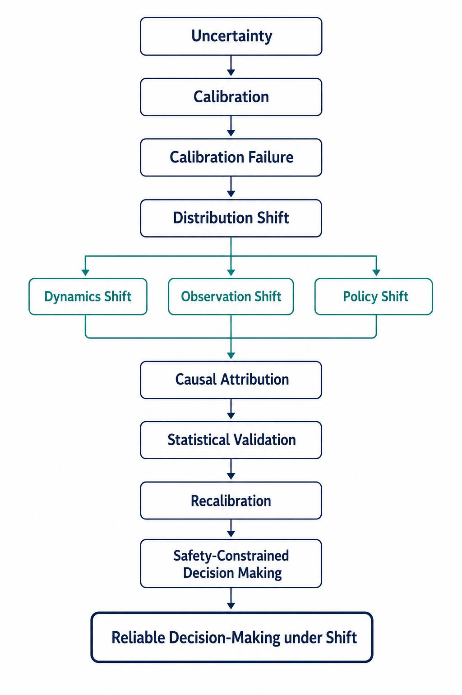

# Morteza Toghani

### MSc AI Researcher
Investigating when and why AI uncertainty becomes unreliable under distribution shift — and what to do about it.

**MSc in AI & Robotics · BSc Electrical Engineering (Power)**

---

## Research Program

*Long-term direction:* **Reliable Decision-Making for AI Systems under Uncertainty and Distribution Shift — A Causal Approach to Calibration and Safety**

**Uncertainty → Calibration → Calibration Failure → Distribution Shift → Causal Attribution → Statistical Validation → Recalibration → Safety-Constrained Decision Making**

---

## Research Interests

- Machine Learning Reliability & Calibration
- Epistemic Uncertainty Quantification
- World Models / Model-Based RL
- Distribution Shift Robustness
- Safe & Reliable Decision-Making

---

## Current Research

**MSc Thesis**  
*Causal Attribution and Statistical Validation of Calibration Failure in Uncertainty-Aware World Models under Offline Distribution Shift*

**Paper 1 — Diagnosis**  
*Why Ensembles Miscalibrate Differently: Causal Attribution of Calibration Failure under Dynamics, Observation, and Policy Shift*  
`PROTOTYPE`

**Paper 2 — Intervention**  
*From Diagnosis to Safety: Causally-Informed Recalibration and Safety-Constrained Decision Making under Distribution Shift*  
`PLANNED`

**Research Lineage:**  
Thesis → Diagnosis → Intervention → Reliable Decision-Making under Shift

---

## Technical Focus

**Python · PyTorch · NumPy · scikit-learn · Git · LaTeX**

---

## Contact

📧 [morteza.toghani.academic@gmail.com](mailto:morteza.toghani.academic@gmail.com)  
🔗 [LinkedIn](https://www.linkedin.com/in/morteza-toghani/)

---

Evidence-first · Research-program-centric · Reproducibility-oriented
